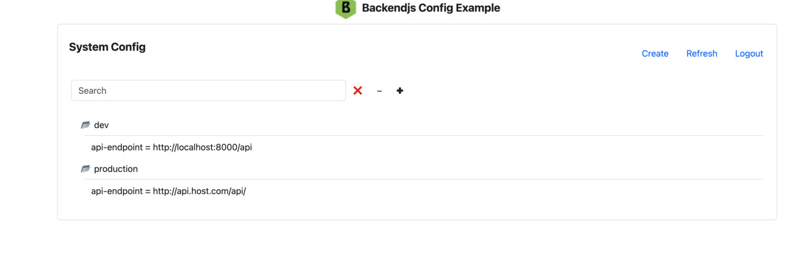

# Backend.js sample CRUD app with Alpine.js to manage config database



## Tech Stack

- **Framework**: Backendjs
- **Database**: SQLite / PostgreSQL
- **Styling**: Bootstrap 5
- **UI/UX**: Alpinejs, Alpinejs-app

### First Time Setup

1. This is an example inside the backendjs repository, so first you need to clone backendjs
   it if it does not exist yet, skip to the next item if you have it

  ```
  git clone --depth 1 https://github.com/vseryakov/backendjs.git
  ```

2. Navigate to the example:

  ```
  cd backendjs/examples/config
  ```

3.. Prepare and start the example

  ```
  npm run setup -- secret PASSWORD
  npm run start
  ```

4. Visit [http://localhost:8000](http://localhost:8000)

5. Login as user "admin" with password you provided above


### Subsequent Runs

```bash
npm run start
```

### Re-create local Database (SQLite)

```bash
rm config.db
npm run initdb
```


### To use DynamoDB

```bash
npm run initdb -- -app-roles dynamodb
npm run start -- -app-roles dynamodb
```

### To use PostgreSQL

```bash
npm run initdb -- -app-roles pg
npm run start -- -app-roles pg
```

## API Endpoints

The following API endpoints are exposed by the app:

Default endpoints implemented by the api.users module:

  - POST /profile
  - POST /login
  - POST /logout

Config endpoints implemeted by the module:

  - GET /config/list
  - POST /config/put
  - PUT /config/update
  - POST /coonfig/del

## Project Structure

```
src/
├── web/
│   ├── config.js      # Config component
│   ├── config.html    # Config HTML template
|   ├── index.js       # app startup code
│   └── index.html     # Home page
├── modules/
│   └── config.js      # Config module with routes
├── var/
│   └── config.db      # Local SQLite database
```

## Features

- ✅ Create, edit, and delete config records
- ✅ Responsive design with Bootstrap theme
- ✅ Alpinejs-app for dynamic updates
- ✅ Alpinejs custom magic $user
- ✅ Input validation
- ✅ Bootstratp dialogs
- ✅ Error handling with loading states
- ✅ Dual-database support (SQLite + PostgreSQL)

## Learn More

- [Backendjs Documentation](https://vseryakov.github.io/backendjs)
- [Alpinejs-app Documentation](https://github.com/vseryakov/alpinejs-app)
- [Alpine.js Documentation](https://alpinejs.dev/)
- [Boostrap Documentation](https://getboostrap.com/)

## License

MIT
