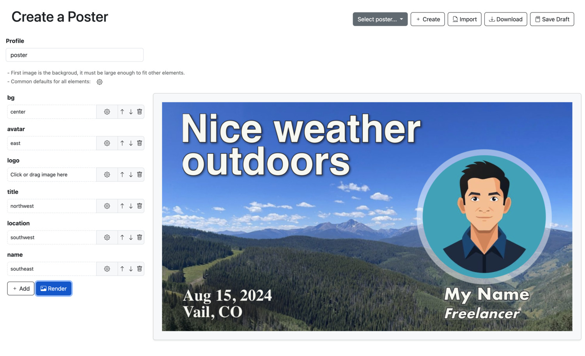

# Poster Composer (Backend.js Example)

Small Backend.js sample that renders social poster images server-side with `sharp`, plus a browser UI to compose layers and send them to the API.

**What’s here**

- `modules/api.js`: API endpoint that composes images and text overlays.
- `web/index.html` + `web/index.js`: UI main page
- `web/render.html` + `web/render.js`: UI Alpine component for rendering images via `/api/render`.

**Run**

1. Install dependencies:
   - `npm install`

2. Start the server:
   - `npm run start`

3. Open in a browser:
   - `http://localhost:8000`

**API**

- `POST /api/render` accepts multipart form data.
- Each form field contains JSON options for a layer; file fields are matched by the same key.
- The first uploaded image becomes the background; subsequent layers (text or images) are composited on top.

**Notes**

- Backend.js is pulled from GitHub (`backendjs`).
- The UI uses Bootstrap and Alpine;
- for testing images from the web folder can be used, just specify in the file path:
  - web/woman.jpg
  - web/man.jpg
  - web/bg.jpg
  - web/bg2.jpg
  - web/bg3.jpg
