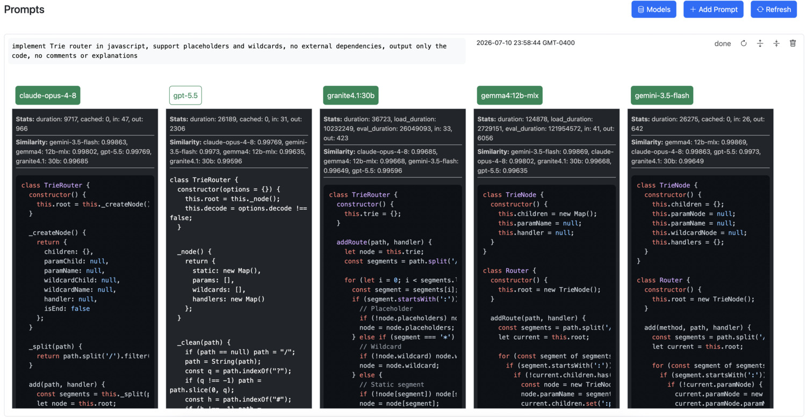
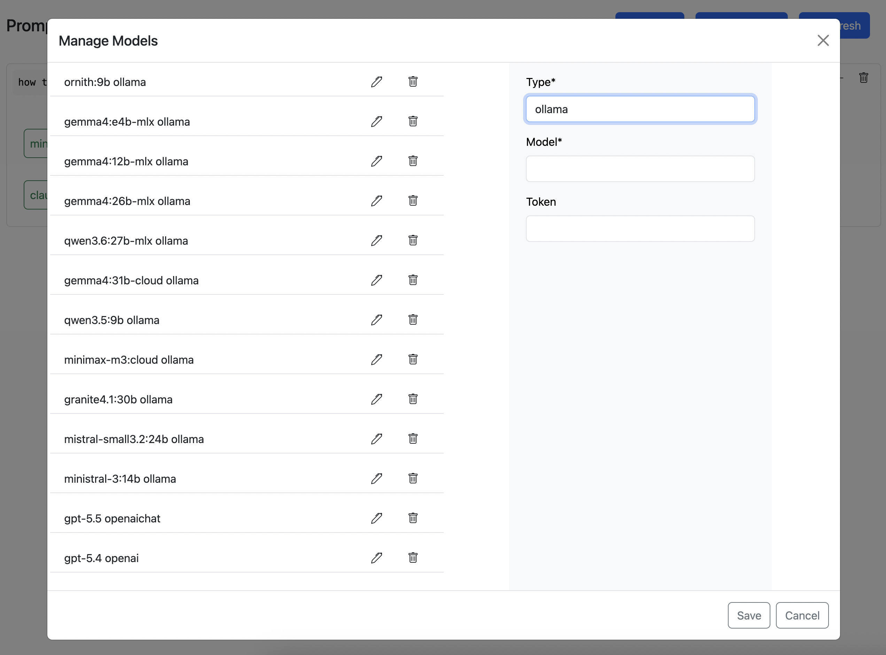

# Backendjs example showing how to compare output from different LLMs side by side






## Summary

This is a demonstration of backendjs modules `api`, `db`, `jobs`, `ws`:

- database tables to store models and results
- API routes to handle requests, validation of input
- a backgrouind job prompting all modesl at the same time and storing results as they come
- calculate cosine similarity for every result against all other results, sort by most similar
- notifying web clients via Websockets about progress and results


### First Time Setup

1. This is an example inside the backendjs repository, so first you need to clone backendjs
   it if it does not exist yet, skip to the next item if you have it

  ```
  git clone --depth 1 https://github.com/vseryakov/backendjs.git
  ```

2. Navigate to the example:

  ```
  cd backendjs/examples/prompts
  ```

3.. Prepare and start the example, no external dependencies are needed

  ```
  npm run setup
  npm run start
  ```

4. Visit [http://localhost:8000](http://localhost:8000)

## Tech Stack

- **Framework**: Backendjs
- **Database**: SQLite
- **Styling**: Bootstrap 5
- **UI/UX**: Alpinejs, Alpinejs-app


## Project Structure

```
src/
├── web/
│   ├── propmts.js     # Main component
│   ├── prompts.html   # Main HTML template
|   ├── models.html    # Models popup
│   └── index.html     # Home page
├── modules/
│   ├── llm.js         # LLM access
│   ├── models.js      # Models API
│   └── prompts.js     # Prompts API
├── var/
    └── prompt.db      # Local SQLite database
```

## Learn More

- [Backendjs Documentation](https://vseryakov.github.io/backendjs)
- [Alpinejs-app Documentation](https://github.com/vseryakov/alpinejs-app)
- [Alpine.js Documentation](https://alpinejs.dev/)
- [Boostrap Documentation](https://getboostrap.com/)

## License

MIT
