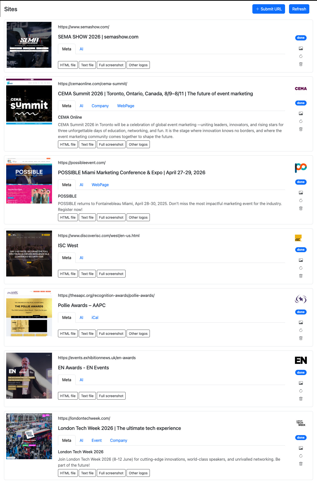

# Events scraper and poster generation




## Summary

This is a demonstration of backendjs modules `image` and `webscraper`:

- scrape an event website, collect details from meta data and screenshots using Puppeteer
- feed the screenshot to Gemeni to describe in specific and abstract terms
- feed AI descriptions to Nano Banana to create several backgrounds variants
- generate posters using these backgrounds with several different layouts and fonts

Poster layouts are saved in the database for each profile, can be easily used by the
`image.compose()` to create an actual poster image with real avatar and texts.

An example of JSON layout with items to be placed onto background using gravity/padding as the main placement strategy.

```js
{
    name: "layout1",
    defaults: {
        padding: 0.05,
        "text.size": 0.07,
        "text.font": "'Roboto Slab', serif",
        "avatar.radius": 2,
        "avatar.width": 0.25,
        "title.width": 0.7,
    },
    items: [
        { id: "bg", type: "image" },
        { id: "logo", type: "image", gravity: "northeast" },
        { id: "avatar", type: "image", gravity: "east" },
        { id: "title", type: "text", gravity: "northwest" },
        { id: "location", type: "text", gravity: "southwest" },
        { id: "name", type: "text", gravity: "southeast" }
    ]
}
```

## Assets saved for each website:

  - `full.png` full-page screenshot
  - `page.png` first-page screenshot
  - `page.html` rendered page source
  - `page.txt` text only content
  - `ld.json` - LD+JSON file
  - `ld.ical` - iCal file
  - `bg-[1...5].jpg` Gemeni generated backgrounds

## Stack

- Backend: Node.js + `backendjs`
- Browser automation: Puppeteer
- UI: Alpine.js + Bootstrap
- Job queue using DB module (`queue/db.js`)
- Default DB: SQLite (`var/scraper.db`)
- File storage: local `var/`

## Project Layout

```text
modules/api.js       # API routes + job handler + Puppeteer logic
modules/gemeni.js    # Gemeni API helper
web/index.html       # Main page shell
web/scraper.html     # Scraper UI
web/scraper.js       # Frontend component logic
web/render.html      # Alpine template for rendering posters
web/render.js        # Alpine component logic for rendering images via `/api/render`.
bkjs.conf            # Runtime, queue, db, files config
```

## Run Locally

1. Install dependencies:

   ```bash
   npm install
   puppeteer browsers install chrome
   ```

2. Create DB tables:

   ```bash
   npm run initdb
   ```

3. Create a config file $HOME/.bkjs.conf with Gemeni key

   gemeni-apikey=A........

3. Start server + worker:

   ```bash
   npm run start
   ```

4. Open:

   - App: `http://localhost:8000/`

## API Endpoints

- `GET /api/list` - list submitted jobs
- `POST /api/submit` - submit `{ "url": "https://example.com" }`
- `PUT /api/resubmit/:id` - requeue a job
- `DELETE /api/del/:id` - delete job and stored files
- `GET /api/asset/:id/page.png` - download screenshot
- `GET /api/asset/:id/page.html` - download saved HTML
- `PUT /api/render/:id` - render a poster with different parameters

## Notes

- This example currently exposes `/api/*` as public in `bkjs.conf`.

## Author
  Vlad Seryakov

